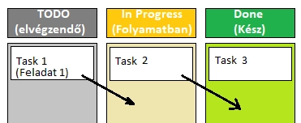
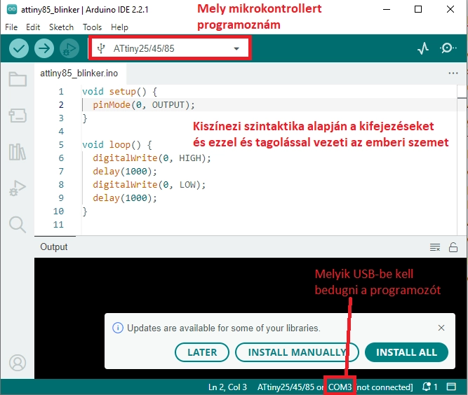

# Programozás alapismeretek

| Szerkesztő | Karácson Péter |
|------------|----------------|
| Lektor     | Szalma Nándor  |
| Állapot    | v1.0           |

## Bevezető

**Ezen parányi összefoglaló célja, hogy támaszt nyújtson azok számára, akik kissé félve vagy kezdeti nehézségekkel vágnak bele a szoftverfejlesztésbe. 
A teljesség igénye nélkül készült, egyedül a könnyed és tömör olvashatóságra fókuszálva.**  
_(Eredeti motivációm: Lehetőleg mellőzném, hogy amíg az ökológiai gazdálkodással foglalkozom, nyomtalanul elvesszen az a tapasztalat, 
amit megszereztem. Továbbá négy év software (SW) fejlesztés után sokat köszönhetek a kollégáimnak. 
Kiemelkedően 2 szenior kollégámnak, akik igazi specialisták. És aki nem igazán specialista, hanem generalista mint mondjuk én, 
az soha nem fog azok nyomába érni, akiknek mindenük a programozás. Ez persze nem gond, csak úgy tűnik, egyeseknek kevésbé áll jól a programozás.
Így ezen kis összegzést köszönetnyilvánításnak is szánom minden programozó számára, akitől valaha tanultam.)_  

Az ökológiai gazdálkodásban Dr. Gyulai Ivántól és programozásban jacidx9 (aka: One Lone Coder)-től hallottam, 
hogy “keep it fun”, avagy “**azért csináld, hogy megtaláld benne az örömödet**”. Talán ez a legnehezebb rész. Főleg, ha fizetést is kapsz.

# 1. Általános irányelvek

## 1.1. A programozási nyelvekről általában

Egy valódi SW fejlesztő maximum viccelődik vele, hogy ez meg az a nyelv mennyire hulladék, de mind tudjuk hogy a JavaScript egy … xd… szóval… mind tudjuk, hogy minden nyelvnek más a hivatása. Annak idején más feladatra álmodták meg őket. A Python-t például azért álmodták meg, hogy magas szinten (kb annyit jelent, hogy kezdőbarátabb), felhasználó-barátan és könnyen olvasható kóddal is meg lehessen oldani bonyolult programozási feladatokat is.

Tehát a kérdésre: Melyik programozási nyelvet válasszam? A válasz: Attól függ! Mit szeretnél készíteni? 

- Weboldalt?  
`JavaScript, React, HTML, Typescript, Vuejs, stb.`
- Asztali alkalmazást Windows-ra?  
`C#, C++, Rust`, talán `Python`, és még sokan mások…
- Kutatási projekt, ahol nem kell a nyelvi sajátosságnak figyelmet szentelni? Vagy simán csak meg akarsz róla gyorsan győződni, 
hogy működik-e egy ötleted (POC = Proof Of Concept)?  
`Python, Matlab`
- Olyan projekten dolgoznál, mely külön elektronikát és energiahatékonyságot igényel? Ez esetben egy mikrokontrollerre 
(kb egy programozható chip-re) van szükséged és valószínűleg alacsony szintre kell mászod (elveszni a részletekben):  
`C, C++` vagy szélsőséges esetben `Assembly`-re lesz szükséged. (Ha kezdő vagy, ez esetben keress az Arduino kifejezésre.)

**A nyelv helyes megválasztása projekt és a rászánható idő függvénye!** Például lehetséges, hogy mind Python tanulással, 
mind Rust tanulással 100-100 órát töltöttem és ezen nyelvek valamelyikét követeli meg a projekted. 
A Rust közel sem tanulható meg 100 óra alatt a komplexitása és a lehetőségei miatt. Ugyanakkor a Python-t van, 
akinek lehetséges 100 óra alatt úgy megtanulni, hogy azt alkalmazni tudja a megkövetelt projektben. 
Vagy kapásból meghatározza, milyen nyelvre van szükséged és, hogy mely HW-en van támogatva. 
PL: Android rendszerre sokáig csak Java-val, Kotlint-al vagy JavaScript-el volt érdemes fejleszteni.

## 1.2. Az eszközökről általában

Sokat szenvedtem már amiatt, mert egyből megpróbáltam valami gazdaságosabb hardware-t (HW) vagyis számítástechnikai eszközt alkalmazni, 
mondván “minek használjak egy kis számítógépet, ha egy számológép számítási kapacitása elegendő a feladat elvégzéséhez? 
Ez az elején egyébként hátráltató optimalizálási szándék 2 okra vezethető vissza: költséghatékonyság és takarékoskodás iránti vágy.  
(Ennek személyes okait a túlzott pszichológiai elkalandozás elkerülése végett nem fejtem ki.)

A lényeg, **egy projekt elején inkább válassz az igényeidnél többre is képes HW-t, minthogy kicentizd a választásod.** 
Tényleg el lehet jutni egy számológép számítási teljesítményével a holdra, de hosszú időn át tartó fejlesztést igényel és 
nagyon fejfájós. De talán ezt “A process-ről” c. fejezetben fejteném ki.

**Egy HW csak annyit ér, mint a community** (fejlesztői közösség), **amely mögötte áll.** 
Ha van például egy régi Banana PI-m (kis mikroszámítógép), amire már senki nem fejleszt és ad ki új operációs rendszer frissítést, 
akkor meg vagyok lőve, mert egy bizonyos dátumon túl nem tudom felhasználni azt a kódot, amit más fejlesztők ingyen megosztottak az 
interneten (többnyire GitHub-on), mert a legfrisebb program-verziók más legfrisebb verziókra épülnek. 
Ha viszont egy Raspberry PI 4-t választok, arra ma is, 2026-ban számtalan programozó fejleszt.

## 1.3. A könyvtárakról általában

Mi ez a **mások által írt, és általam (valamilyen megkötéssel, License-el) felhasználható kód**, amiről az imént beszéltem? 
Ezt bizonyos programozási nyelvekben úgy hívják, “könyvtár” (library), másokban úgy, hogy package. Egy ilyen könyvtár része lehet például, 
hogy hogyan rajzoljak ki egy piros téglatestet a képernyőmre. Ez alacsony szinten (C, C++, Rust, Assemply, etc. nyelven könyvtár 
meghívása nélkül) implementálva (megalkotva, kódolva), rémálom lenne. Szerencsére voltak specialisták, 
akik ezt nekünk már meg is írták és így mindössze meg kell hívni a saját kódunkban az ő kódjukat, ha használni szeretnénk azt. 
Azon könyvtárat, melynek nyilvánosan láthatod a forráskódját “open source”-nak, melynek nem nyilvános a kódja, “closed source”-nak nevezzük. 

## 1.4. A process-ről (= munkafolyamat rendszere)

A process fogalom megértéséhez képzeljük el, hogy egy műhelyben dolgozunk. Eleinte nem tanultunk semmit a műhelyekről vagy arról, 
hogyan is kell a benne lévő szerszámokat használni. Ugyanakkor ki akarjuk használni a műhelyben rejlő potenciált és alkotni valamit. 
Nekiállunk a munkának és rövid időn belül azon kapjuk magunkat, hogy káosz van. Nem csak az asztalon, hanem a fejben is, mert nem találjuk, 
ami 5 perccel ezelőtt még megvolt vagy nem tudjuk melyik szerszám után kapjunk hirtelen. Ez a process hiányát jelzi. 
A process tehát az a szabályrendszer, ahol a munkád lépései konzisztensen (egyazon elv mentén) meg vannak határozva. 
Ha a process jól lett kitalálva, akkor ha betartod, segíti a munkádat, ha nem, akadályozza. Ha a process egy része inkább akadályoz, 
mint segít, a csapattagokkal meg lehet beszéni annak változtatását.

**Minden szakmának kell legyen process-e**, ha profi akar lenni, és hatékonyan akar dolgozni.

Megpróbálom néhány pontban összegezni a process készítés alapszabályait:

1. Első szabály: 
**Nincs egy egzakt szabályrendszer, amit minden projektre rá lehetne húzni**
2. Attól, hogy van process, még nem azt jelenti, hogy az mindent megold helyettünk.
Fontos a process, de nem szabad átesni a ló túloldalára sem, és abba a végletbe elmenni, hogy csak a process-t tökéletesítgetjük, 
de nincs érdemi munka. 
**A tökéletes a process és a nincs process két kerülendő véglet. Ne próbáld rögtön a projekt elején megtalálni a megfelelő process-t.**
3. Valószínűnek tartom, hogy minél rövidebb ideig fog tartani egy projekt és minél kisebb a komplexitása, 
annál kevésbé kell definiálni a process-t, és annál kevésbé szigorúan kell betartani azt. Ugyanakkor:
4. A dokumentáció lehetőleg legyen mindig a process része. Egy doktorandusz barátom témavezetője ezt mondta: 
**Ami nincs dokumentálva, az nem történt meg.**
Szerintem van ebben valami, de a valóságban sokszor nincs erőforrás a dokumentáció megírására. 
Ha azonban priorizálni kell, akkor a legfontosabb 3 dokumentáció fajta:
    1. Hogyan kommunikáljon a felhasználó a programmal: Ezt a kommunikációs “felületet” nevezzük API-nak (Application Programming Interface-nek). Ez körülbelül annyit jelent, hogy az alkalmazás vagy program kommunikációs felülete. Az interface fogalom a későbbiekben ennél jobban ki lesz fejtve. 
    2. A program magas szintű elvárt funkcionalitásainak dokumentációja (Architektúra ábrák, követelmények, több file együttműködését összegző doksi, stb.). 
    3. Legalacsonyabb, a kód szintű dokumentáció: Egy jól megírt programban maximum olyan “hint”-eket érdemes írni, amelyek nem látszódnak egyértelműen a kódból. Tökéletesen nem lehet ugyan ezt elérni, de törekedhetünk a következőre: jó kódot nem kell dokumentálni, önmagáért beszél.
5. Célja, hogy vezetőség számára a fejlesztési folyamat nyomonkövethető legyen.

### A process részei lehetnek a következő eszközök:

- **Verziókövetés**  
PL: Projekthez Git vagy adatokhoz Git LFS vagy DeltaLake. (A verziókövetésről majd később, de röviden annyit tesz, 
mintha lenne egy varázseszközöd, ami megengedi, hogyha asztalos vagy, visszaállítsd az épített székedet arra az állapotra, 
mikor még nem ragasztottad bele a lábát, hogy lásd, azért mozog-e a lába, mert nem jól vágtál nútot, vagy valami más miatt.)
- **Projekt menedzseri eszközök**
    - Scrum board vagy Kanban board, amely egy tábla, ahol egyben látható az összes csapattag feladata. Ki min dolgozik éppen, 
  kire milyen feladatok várnak még, stb. A következő ábra egyetlen csapattag feladatait mutatja be a board:
        
        
        
    - SW fejlesztési módszer / megközelítés / hozzáállás: Agile, waterfall, scrum, kanban, lean, six sigma, etc. 
  [ITT olvashatsz többet angolul](https://www.geeksforgeeks.org/software-engineering/what-is-software-development-methodology-15-key-methodologies/).
    - PL: Jira, amivel nyomonköveted, manageled a SW fejlesztését
- **Ki milyen felelősségeket vállal a csapatban**.  
Kinek mi a feladatköre a csapatban? Ezeket ajánlott előre tisztázni a káosz elkerülése végett. (_[Technical Debt](https://en.wikipedia.org/wiki/Technical_debt)_)  
Erre egy SW fejlesztői csapatban különböző szerepek (role-ok) alakulhatnak ki:
    - Szoftverfejlesztő (SW developer / engineer): Ők írják a kódot és építik fel a szoftver funkcióit. Tapasztalatuk, önállóságuk és 
  felelősségi körük alapján három fő szintre osztjuk őket:
        - Junior: A meglévő kereteken belül már tud kódot írni, de a bonyolultabb feladatokhoz még segítségre, 
      útmutatásra és szorosabb kód-átnézésre (Code Review) van szüksége.
        - Medior: A rá bízott feladatokat képes önállóan lebontani, megtervezni és megvalósítani; reálisan becsül időt, és 
      kiszámíthatóan valósítja meg a megoldásokat.
        - Senior: Nemcsak a saját feladatait oldja meg önállóan, de átlátja az egész rendszert, segít a technológiai döntésekben, és 
      aktívan mentorálja a kisebb tapasztalatú csapattagokat.
    - Architect: Ő tervezi meg a teljes rendszer struktúráját, mielőtt a programozók elkezdenék írni a kódot. 
  Kiválasztja a megfelelő technológiákat és SW fejlesztési eszközöket, hogy a szoftver később is megbízható, biztonságos és 
  könnyen bővíthető maradjon.
    - Scrum master: A zökkenőmentes munkavégzést biztosítja. Eltakarítja az akadályokat a fejlesztők útjából, és ügyel arra, hogy 
  a csapat fókuszált maradjon a feladatai kapcsán. Kisebb cégeknél kapnak esetleg más feladatokat is, 
  de ez eredetileg nem része ezen munkakörüknek.
    - Projekt menedzser: A büdzséért, a határidőkért és a végleges célok megvalósulásáért felel. Ő tartja a 
  kapcsolatot az ügyfelekkel vagy a vezetőséggel, és folyamatosan egyensúlyban tartja az elvárásokat a csapat meglévő erőforrásaival.
    - Tester: Nem közvetlenül a végfelhasználónak “kódol”, hanem megpróbál hibás működést kicsikarni a programból 
  ("eltörni" a kódot, “break the code”), mielőtt az élesbe publikálva lenne (release-elve lenne). 
  Kézi vagy automatizált tesztekkel kiszűri ezen hibákat (bugokat), így garantálva a szoftver megbízhatóságát.
    - További role-ok, amelyeket most nem részletezünk: Product owner (PO); DevOps Engineer; QA Engineer; UI/UX Designer, Research engineer, etc.
  
  Érdemes megjegyezni, hogy ezen szerepek eltérő mértékben fenntarthatók a projek mérete és erőforrásai függvényében.
  Például valószínűleg nem tudsz scrum-master-t fizetni külön csak az egyetemi projektedhez. Jobbhíján kénytelen vagy magadat támogatni.

- **Interfacek!!! Ezt nem lehet elégszer elmondani mennyire fontos**. Az interface egy egyezmény. Megígérjük egymásnak (ideális esetben a projekt elején), 
hogy milyen struktúrákkal fogunk egymással kommunikálni. Például egy műhely manufaktúrában, ahol Béla a szék lábakat, 
Jani a szék ülő lapját gyártja, az előtt meg kell egyezzenek arról, hogyan fog a szék lába a szék ülőlapjához csatlakozni, 
mielőtt munkába kezdenének. Ez az illeszkedés maga az interface.
Az interface-en nagyon költséges később változtatni a projekt élete során, ezért nagy gondosan kell azokat kiötleni.
(Képzeljük csak el, hogy a faanyagból már kifaragott Béla, de félreérthetően volt definiálva a csatlakozás és sajnos túl sok anyagot faragott le. 
Ekkor a láb lazán illeszkedik majd az ülőlapba és Béla meg Jani majdnem ugyan ott tartanak, mintha egyáltalán nem beszélt volna össze.) 
Az interface-eknek az elkészültségi foka befolyásolhatja a projekt függöségeit (dependency). Ha valaki használ valamilyen interface-t, 
akkor a mögötte lévő funkcionalitásnak kész kell lennie mire az a valaki használatba veszi azt.
Az interface-k lefixálása emberek között is fontos a csapatban. PL: Béla, minden héten ezt meg ezt a fájlt fogja átadni Janinak és megkéri, 
végezze el ezt meg ezt a folyamatot rajta.
- **Formai követelmények**  
Ez nem egy megfogható “eszköz”, de érdemes megegyezni a forráskód egységes megjelenésén és az ezt segítő eszközökön, ami lehet:
    - **IDE** (Integrated Development Environment): Egy olyan program, amiben írod, olvasod, szerkeszted a kódot. 
  Persze ezt egy jegyzettömbben is megtehetnéd vagy egyenest papíron, de sokkal hosszadalmasabb lenne, mint egy IDE segítségével. 
  Programozási nyelvtől és felhasználási területtől függ, melyik IDE-t mikor, mire használjuk: 
      - Arduino (C++ nyelv mikrovezérlőkhöz), 
      - PyCharm (JetBrains termék Python nyelvhez), 
      - VSCode (Microsoft termék főként C, C++, Rust nyelvekhez), 
      - Eclipse (Java nyelvhez).  
      
      Például itt látható az Arduino IDE-ről egy kép, amin megjelöltem 3, az IDE sajátosságát, mely segíti a mikrokontrollerre történő fejlesztést:
        
       
        
    - **Linter-ek** (szösztelenítő): Célja, hogy a kódminőséget javítsa. Ez egy automatizálható forráskód felülvizsgálat (ún. review). 
  Tehát nem kell hozzá emberi munka, de cserébe nem teljes körű. Olyan, mint egy előszűrés minőség-ellenőrzés során. 
    A linter lehet egy önállóan futtatható, vagy egy IDE-be beépülő programocska.
    Például: Lehetséges, hogy a programodban egymáshoz kísértetiesen hasonló 10 egybefüggő sort írtál két különböző helyen. 
  Ezeket érdemes lehet úgymond “kiszervezni” egy ún. “függvénybe”, hogy a programban egyszer kelljen csak leírni és egyszer 
  kelljen értelmeznie a fejlesztőknek és könnyebben karbantartható legyen. (A függvényekről később írunk.)
    - **Formatter**: Célja, hogy segítse a forráskód átláthatóságát és azért felelős, hogy betartassa velünk a kódra vonatkozó formai követelményeket, 
  ha már egyszer megegyeztünk ezeken. Mind az írott forráskód, mind annak dokumentációját meg kell határozni, hogyan nézzen ki. 
  Például: A golbális változókat Pythonban csupa nagybetűvel, szavait alulvonással elválasztva írjuk pl: SCREAMING_SNAKE_CASE). 
  (Arról, hogy micsoda egy változó, később írunk. Ezt a fenti példát egyébként naming convention-nek nevezzük.) 
  Másik példa, hogy hogyan tagoljuk a kódot. Lehet, hogy szintaktikailak Béla kódja ugyan azt jelenti, mind Janié, 
  de ha nem egyeztek meg formai követelményeken, első ránézésre olyan, mintha különböző nyelvet beszélnének. 
  Akár akkor is, ha ugyan azt a funkcionalitást írták…
    - **Dokumentáció:** A fő dokumentációt, amelyet a projekt mappa legtetején helyeznek el a fejlesztők README.md-nek hívják. 
  Ezt ún. Markdown szintaxis segítségével formázzák. Arról, hogyan működik a Markdown, pl.: [markdown cheatsheet](https://www.markdownguide.org/basic-syntax/) néven olvashattok.
  
- **Requirement management system**  
Olyan program, amely olyan szabályhalmazt / dokumentumokat kezel, amely a fejleszteni kívánt programmal szemben támasztott elvárásokat rögzíti, fixálja. 
PL: Integrity. Kisebb cégeknél, ez nem jellemző. Célja, hogy átlátható legyen, miben egyeztek meg a fejlesztés kapcsán és, hogy segítse a tesztelők munkáját, 
egyértelművé tegye a tesztelési folyamatot. (Az elvárást támasztó személyt hívhatjuk customer-nek. 
Ez az a személy, aki felé felelősséggel tartozunk a fejlesztett funkcionalitásért.)
Hátrány lehet a következő eset: A projekt elején még a megrendelő nincs teljesen tisztába azzal, mit szeretne, vagy a megrendelő folyamatos fejlesztést kér.
Ekkor lehetséges, hogy a fejlesztői csapat elkezd dolgozni, de egy ponton túl a megrendelő egy olyan változtatás kér, amely 
az ő szemszögéből könnyen eszközölhető, azonban a projekt számára ez nagyon költséges. Ugyanakkor a jól definiált requirement-ek mindig jó, ha 
vannak, igaz, ez többlet költséget jelent a fejlesztés során. 
A requirement-ek előnye az is, hogy egyfajta dokumentációt képeznek. Ha egy projektet magára hagynak, évek múltán költséges lenne csak 
a forráskódot olvasgatva visszabogozni, mit is csinál az pontosan. Ebben segít, hogyha annak idején jól definiált és a 
projekt élete során pontosan betartott követelmény halmaz áll rendelkezésre.
Egy példa: Egy csapat rádiót fejleszt. A szabványszervezet elvárt követelménye az, hogy a rádió egy meghatározott kommunikációs 
protokoll szerint üzemeljen. Ez egy requirement.
- Test framefowrks
- Pipelines CI/CD

## 1.5. A csapatmunkáról általában

1. Merj kérdezni! Ha bekerülsz egy új projektbe és annyi kérdésed merül fel benned hirtelen, hogy azt sem tudod, mi a kérdésed, 
kérdezz “hülyeségeket”. Ha a kollégáid ezt még a betanulási időszakban sem tolerálják, szomorú, ne csüggedj.
2. Ne kérdezz feleslegesen hülyeséget. Bármit megkérdezhetsz egyetlen feltétellel: Előtte kérdezd meg magadtól: 
**Tényleg megpróbáltam alaposan utánajárni?** Persze ha órákat töltenél valaminek a kikeresésével, hatékonyabb egy kollégát megkérdezni. 
(Legyen ez a határérték mondjuk fél óra utánanézés.) De ha olyanokkal zaklatja az ember a kollégáját, aminek néhány perc alatt utána lehet járni, 
akkor te sem tanulsz és a szenior kollégád sem halad. A senior dev., akitől a legtöbbet tanultam programozás kapcsán, ezt mondta viccesen: 
“**Én semmihez sem értek. Mindössze annyit tudok, hogyan kell használni a Google keresőmotorját.”**
3. **Egy jó csapatban nem főnök van, hanem vezető**, aki kikéri a csapattársai véleményét, mert egy hajóban eveztek. 
Mikor megkérdeztek egy nagy zenszerzetest a tanítványai, mi a legnehezebb az életben (a tanítványok sorra faggatták, hogy a 90 
napos elvonulás-e vagy az az elvonulás, amibe majdnem belehalt) azt válaszolta, hogy “az emberekkel való együttműködés”. 
Sajnos ebben egyetlen akadályunk az egoitásunk, azaz önismeretünk és az arra épülő önmeghaladásunk hiánya.

Hiányzik:

- Kutatási irányelvek
- Tesztelési irányelvek
- Fejlesztési irányelvek
- Review irányelvek
- Priorizálás: Példa: 1 task és 2 bug ticket közül melyik a legkritikusabb. Mi az, ami alapján priorizálsz? 
Vevői igények, határidő, security, budget, emberi erőforrás, számítási erőforrás, eszköz erőforrás, bármi ami erőforrás
- Lisence
- V-modell
- Kiberbiztonság
- OOP, Functional programming

# 2. Verziókövetés

# 3. Nyelvek

## 3.1. Python

---
# [🔙 _Vissza_](../README.md)