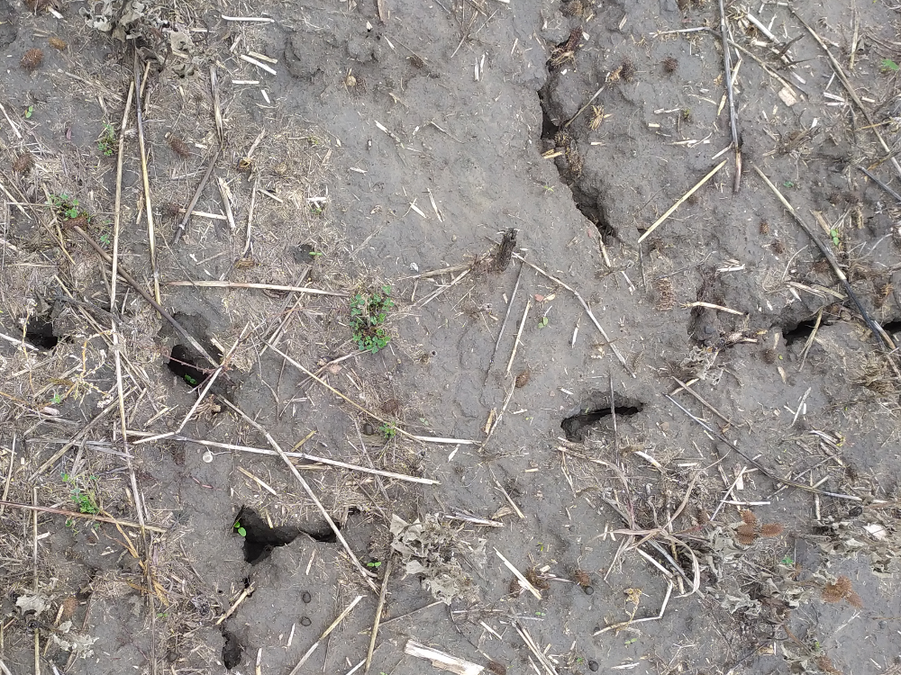
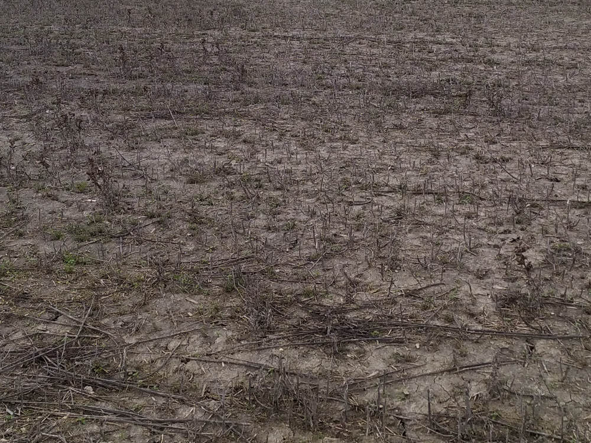
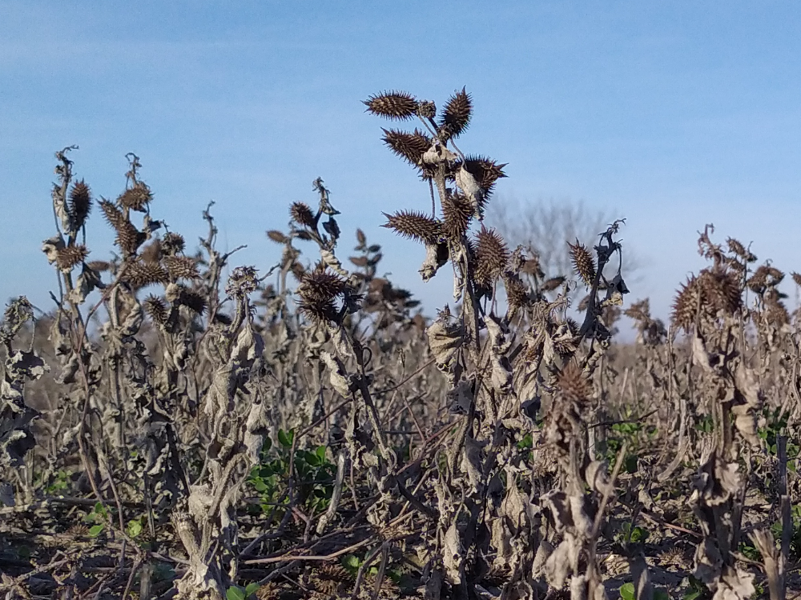
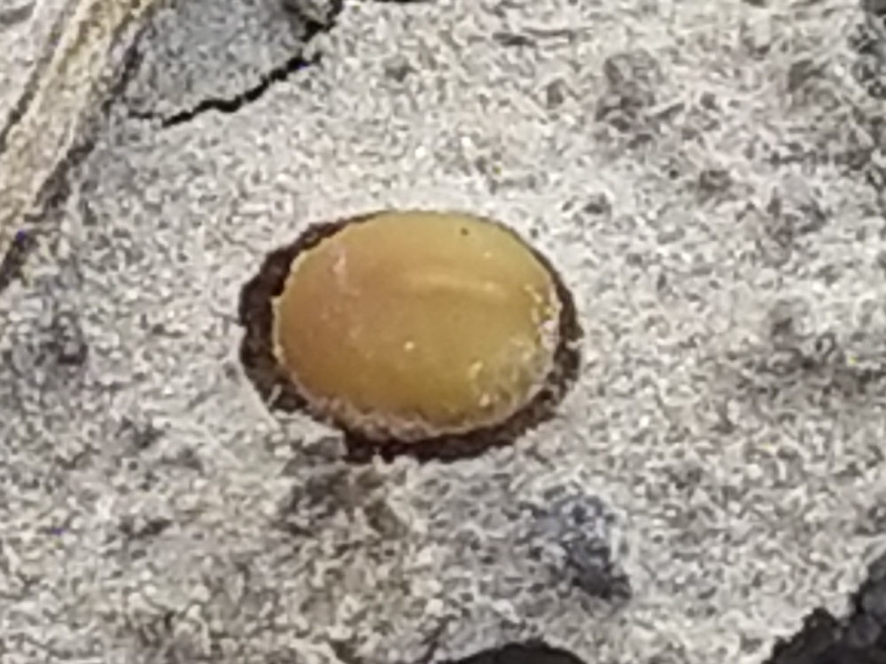
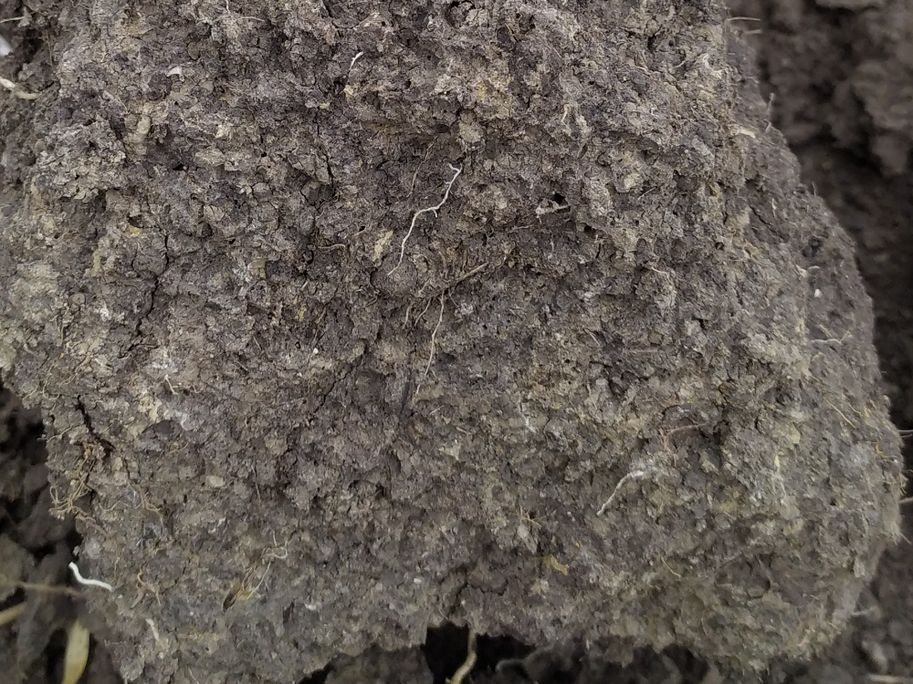
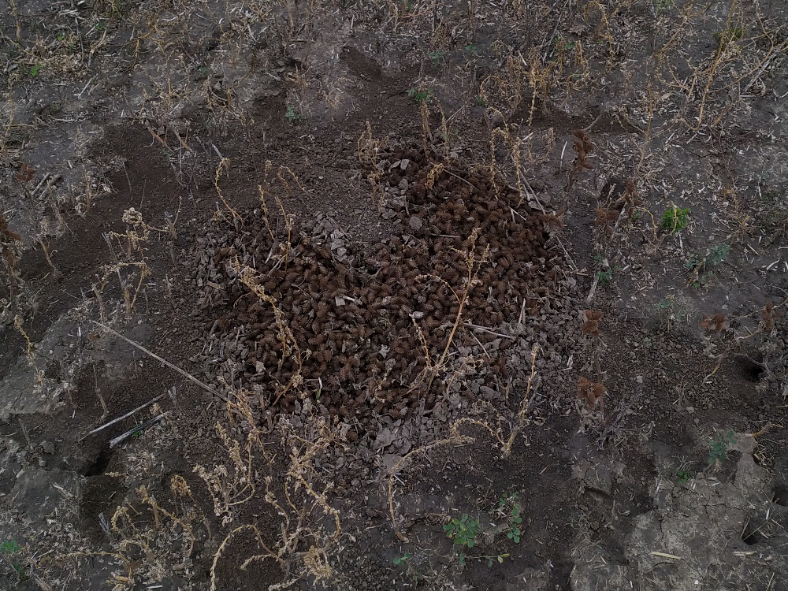
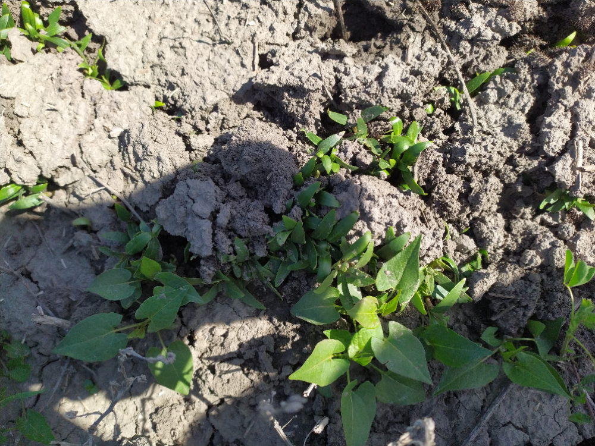
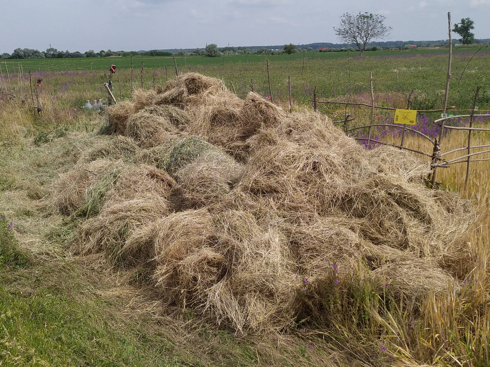
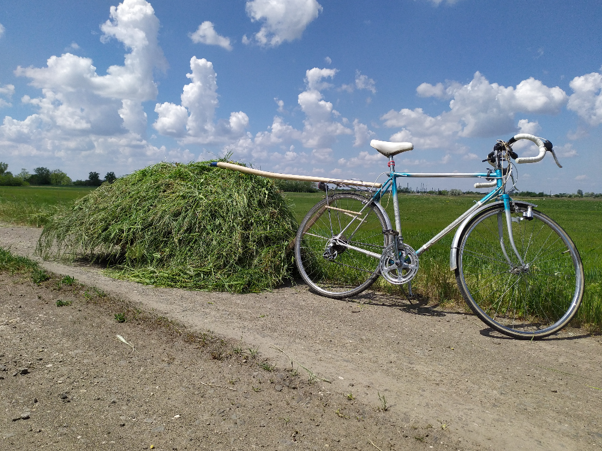
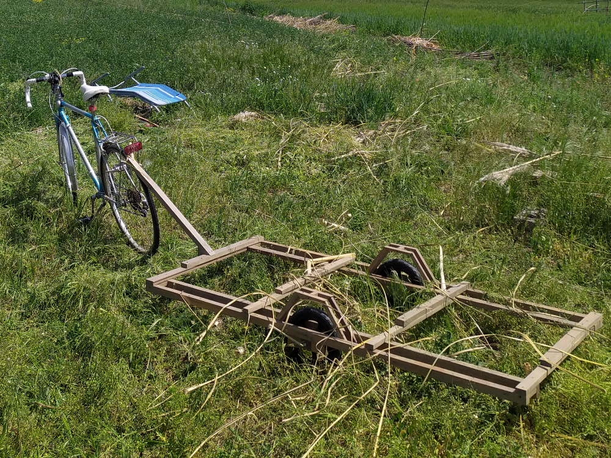

# Tápé Széle

| Szerkesztő | Karácson Péter |
|------------|----------------|
| Lektor     | -              |
| Állapot    | v1.0           |

(A dokumentum képei 1000 pixel szélesek és 750 pixel magasak. 
Eredeti és további képekért vedd fel a kapcsolatot a szerkesztővel a karacsonpeterzsolt@gmail.com e-mail címen.)

Ezen jegyzőkönyv nagyjából évente kerül frissítésre, minden ősszel. Azért döntöttem így, mert az Alföldön jelenleg úgy látszik, 
ősszel számíthatunk ismételten számottevő csapadékra és újabb esélyre, hogy valami más csírázhasson ki öntözés nélkül.

## 1. A dokumentált "kert" fő jellemzői
- Nagyjából 20 db kisebb-nagyobb átmérőjű, ~120bar nyomású stratégiai gázvezeték halad át rajta. ~4100nm-ből mindössze ~100nm nincs 
valamelyik gázvezeték védősávjával fedve.
- Mikrodomborzat alapján lokális dombnak számít az Alföldön.
- Előző gazda valamiféle no-till / min-till technológiát alkalmazhatott, ugyanakkor feltehetőleg a korábbi néhány évtized 
művelése teljesen tönkretette a talaj szerkezetét.

### 1.1. Talaj
- Erősen bolygatott, papíron kb ~24 aranykorona/ha termőképességű csernozjom. Rossz vízelvezetésű. 
- Talajszerkezetet nyomokban tartalmaz. Amennyiben a felső 5 centi eddig még nem kövült meg, az kézzel talaj-lisztté morzsolható.
- A felszín alatt ~30-50 centiméterrel lévő vályogban rozsdafoltok jelzik a hajdani időszakos vízjárást. (Kagylók is találhatók benne.)

#### 2025.11.23.
- ~3cm vastag repedések nyomai a talajon
- Elszáradt [Bojtorján szerbtövis](https://hu.wikipedia.org/wiki/Bojtorj%C3%A1n_szerbt%C3%B6vis) az egész területen.
Ez a talaj bolygatottságát, rossz vízelvezetést jelzi, mint indikátornövény.
- Előző gazda által vetett lucerna csak késve, ritkásan kelt ki

#### 2026.02.10.
Csupasz, szárító hatásoknak kitett talajfelszín. Késve, feltehetőleg maximum néhány éve megkezdett no-till szármaradványok. 
Ezek nagyjából fele bojtorján szerbtövis.

#### 2026.03.01.
Indikátor növény: [Bojtorján szerbtövis](https://hu.wikipedia.org/wiki/Bojtorj%C3%A1n_szerbt%C3%B6vis)

#### 2026.05.19.
Az (azonosítatlan) kuszó gyomnövény magja képtelen a lisztté "őrölt" talajjal való kontaktusra egy esőzés után 

#### 2026.07.07.
Kiásott, az eketalp mentén elvált nagyjából 7 kilós "rög". Márványszerű talaj-törésfelszín.
A legnagyobb ehhez hasonló ásóval szét nem verhető rög nagyjából 30 kilós volt.

## 1.2. Környék
- Intenzíven művelt mezőgazdasági táblák (kb 500m sugarú kör ~70%, amelynek kb 70%-a no-till / min-till)
- Néhány kiskerthez hasonló kisebb szántó (kb 500m sugarú kör ~2-5%)
- Olaj, gáz és termálkutak (kb 500m sugarú kör ~2%)
- Utak, útszélek, 150 méterre elhelyezkedő mesterségesen, a Vesszősi pozitív kúttal is pótolt Tápéi-főcsatorna
- Tisza 1km-re

## 2. Munkálatok
1. Őszi barna borsó, mák és tritikálé vetés  
   - A borsó szépen kinőtt, de nagy részét lelegelték az őzek és a virágok egy részét bundás bokarak dézsmálták.
   - Tritikálét is talajjavítás miatt vetettem, de egy egybefüggő 400 négyzetméteres területre. 
     Egészségesnek tűntek az érett szemek, nagyjából 70-80cm magas kalászokkal.
   - Mákot egy csekély, kb 50 nm foltba vetettem sűrűn. Itt sajnos nem érezte jól magát, talán a túl tömör és kopár talaj miatt. Alig termett valami.
   
   Tanulság: **Ne akarj egyből eredményt felmutatni! Ha eddig intenzíven művelt területet vettél (mi másért adná el bárki, 
   ha nem a felelőtlen gondozás miatt bekövetkezett károk végett), első lépés a talaj javítása, ökológia helyreállítása 
   és évekkel később lehet valóban a termelékenységgel is foglalkozni.**  
2. Bojtorján szerbtövis szárainak és termésének összegyűjtése
Mivel azt olvastam ez a növény rendkívül invazív, kissé pánikoltam, mi lesz ennyi kipergett maggal. Ezért kezdtem el gyűjteni.
Fölösleges volt. A bojtorján szerbtövis egy kényes növény. Sehol nem nőtt ki kb, holott előző évben leuralta a földemet. 
Ez azért is lehetséges, mert a lucerna és más "gyomnövények" is szépen kinőttek és a szerbtövis nem annyira jó versengésben.
Másfelől azért is lehetséges, mert az összes biomassza, amit képes voltam kis kazlakba csoportosítani (elszáradt szerbtövis szárak),
védelmet nyújtott a rágcsálók számára, akik télire megkezdték a hordást. A rágcsálók a kipergett magok jelentős hányadát behordták és részben elfogyasztották.
A következő képek egy güzüegérvárat és abból tavasszal tömegesen csírázó, halálra ítélt szerbtövis "telepet" mutat.

   

   
   
   Tanulság: **Ha szervesen bármivel megajándékozod a földedet, a természet "tudni fogja" mihez kezdjen vele. Itt mindenki életben akar maradni, 
   aki arra csak kicsit is szakosodott, megtalálja a kupac biomasszádat és ő nála senki nem tudja majd jobban, mihez kell azzal kezdenie.
   Ne próbálj olyan munkát végezni, ami nem a te feladatot. Tedd fel a kérdést: PL: Miért nincs itt az, 
   aki elvégzi helyettem mondjuk a fák ültetését? A természet csak a szervetlen anyag inputtal nem tud mit kezdeni.**

3. Kevés mulcsolás útszéli kaszálékkal  
2025 őszén csekély mennyiségben kb 20-30cm vastag mulcs-kígyót hordtam a földem egyik felére felmagzott nyár végi út széli kaszálékból.
Az őszi esőzésekkel tapasztaltam, hogy új füvek és gazok nőttek ott, ahol a mulcs elég vékony volt ahhoz, hogy a csírázó magok átnőjenek rajta.
Később tudtam meg, hogy ezt úgy hívják, **seed-rich mulching**.
4. Telek határainak körülbelüli kijelölése
5. Vadkár elleni védekezés  
   Kívül akartam tartani bizonyos kártevőket, akikkel első pillanattól kezdve meggyűlt a bajom: őzek, nyulak. 
   Később realizáltam csak, hogyan illeszkednek a rendszerbe. **Amíg a talajjavításra összpontosítasz, fölösleges a
   kerítés vagy villanypásztor.**
6. Silócirok vetés  
Nem kelt ki, túl kötött talaj, nem elegendő csapadék miatt.  
7. Mulcsolás & kaszékgyűjtés
   - Májusi kaszálék vásárlása helyi gazdától  
     Seed-rich mulching megvalósításához egy helyi gazdához álltam be segíteni, akiknek gyorsan le kellett kaszálnia május 
     végén az árvízvédelmi töltést, hogy behordjon kb 1400 kisbálát mielőtt az megázik. Ez egy napi kemény munka volt, melynek
     fejében kb 20 db, mindenféle fajjal felmagzott kisbálát kaptam. Ezzel vékonyan befedtem a kopár részeket, 
     visszafogva a nap és a szél szárító hatását.  Továbbá azt várom, hogy ez ősszel a fajban gazdag állomány csírázását eredményezi majd.  
       
   - Tákolt bicikli utánfutó  
     Nagyjából ugyancsak 20 kisbálányi kaszálékot hordtam be kézi kaszálással útszélekről és egy DIY bicikli utánfutóval.
     Ezzel a setuppal, megfelelően elkészített utánfutóval, megfelelő kaszával és kaszálási tudással egy nap alatt be lehetne 
     hordani kb ugyan azt a mennyiségű szénát, mint amennyit a gazdától munkámért cserébe kaptam.  
     Az utánfutó elkészítéséhez javaslom csak átmenő csavarok alkalmazását önzáró anyákkal. Továbbá, hogy az utánfutót a 
     kerékpárhoz rögzítő gömbcsukló (rövid kötél) a vontatmány rakodófelületének síkjával egybe essen. (Mint a személygépjárműknél.) 
     (Legolcsóbb tömörgumis kerék (defekmentes) és cseréplécek. Plusz valószínűleg jól jönne a rakodófelület körül egy ketrec, ami megnövelné a rakodható kaszálék mennyiségét.)   
     Továbbiakban csak a földön belül megtermett biomassza optimális átcsoportosítására fogok összpontosítani külső input nélkül.  
       
       
8. Magok gyűjtése & vetése  
   Próbáltam teljesen véletlenszerűen, többnyire szórva, vékony mulcs alá vagy szemmel láthatóan lazább talajra vetve, mindenféle, 
   többnyire a környékből begyűjtött magot vetni.
9. Gödrök & árok váddal mulcsolása  
   Mivel a földem egy mikrodomb, próbáltam körülárkolással valamelyest megakadályozni a víz lefolyását úgy, hogy az 
   árkot nád maradványokkal töltöttem fel. Ugyan így gödröket is létesítettem a rágcsálók áttelelésének segítésére, 
   mert a korábban említett güzüegérvárba tavasszal beletúrva kiváló minőségű, humuszban gazdag talajt találtam.

## 3. Munkálatok konklúziója
1. Ha intenzív mezőgazdasági / gyenge talajminőségű területet veszel, az elsődleges cél a talajjavítás és az ökológia helyreállítása. 
2. Dr. Gyulai Ivánnak számos kérdésben igaza van. Azért mondta, hogy "meg kell hívni a kártevőket a kertünkbe", mert 
miattuk működik a természetes szukcesszió. Ha valamelyik kártevőt kizárom a rendszerből, az általa hozott hasznot is elvágom.
Mindenre szakosodott valaki, mindenkinek meg van a helye. **A bőség, a biztonság, a robosztusság a faji diverzitás mellékhatása.**
3. Lehetségesnek látszik az "édenkert" és "felelősen uralkodni a föld növényein és állatain".  
   3.1. Figyeld meg, mihhez akar kezdeni a természet a földeden.
   3.2. Vond le a következtetéseket, milyen adottságai vannak a kertednek, mi kedveli még azokat az adottságokat.  
   3.3. Ezeket próbáld meg termeszteni, amik működni és ne azt, amire vágysz.  
   3.4. Próbálj terméket készíteni abból, amit az a rendszer ad neked, amiért felelős vagy.

## 4. TODO: Az élővilág jelei, jelentése a rendszer jelen állapotára nézve

---
# [🔙 _Vissza_](../documented_experiments.md)