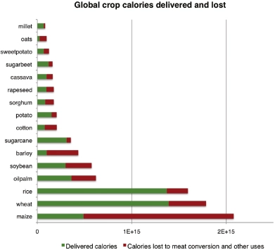
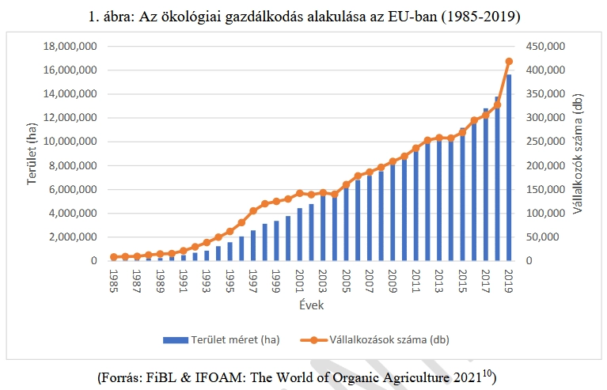
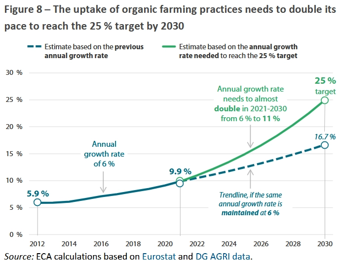
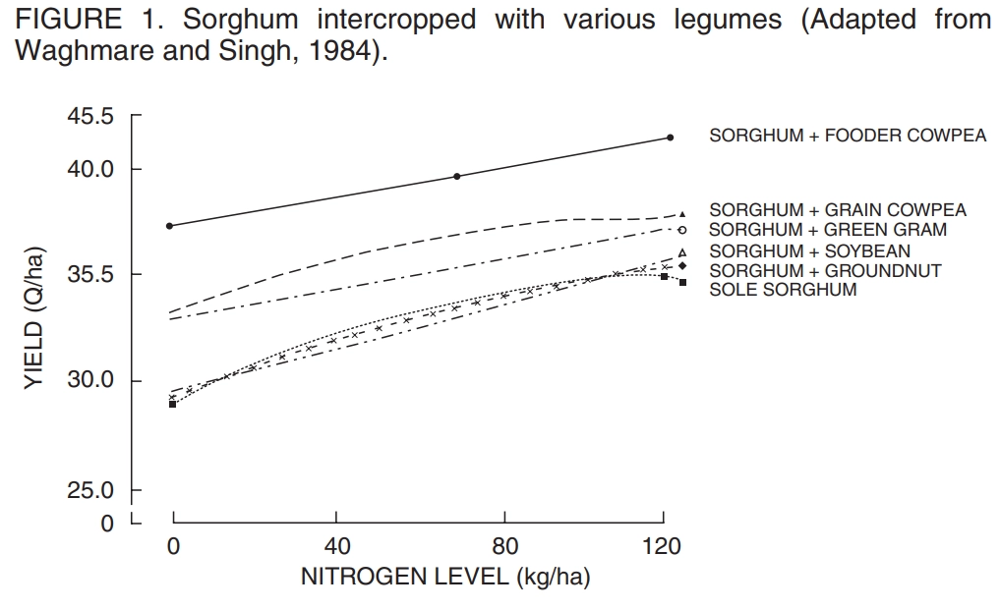

# 👩‍🌾 Szántás vs. Öko

| Szerkesztő | Karácson Péter |
|------------|----------------|
| Lektor     | -              |
| Állapot    | v1.0           |

## 1. Az "Ökológiai" VS. "Business as usual" életvitelek rendszerelemeinek összehasonlítása  
[Redefining agricultural yields: from tonnes to people nourished per hectare (2013)](https://iopscience.iop.org/article/10.1088/1748-9326/8/3/034015)
> *“Currently, 36% of the calories produced by the world’s crops are being used for animal feed, and only 12% of those feed calories ultimately contribute to the human diet (as meat and other animal products).” … In this study, we re-examine agricultural productivity, going from using the standard definition of yield (in tonnes per hectare, or similar units) to using the number of people actually fed per hectare of cropland. We find that, given the current mix of crop uses, growing food exclusively for direct human consumption could, in principle, increase available food calories by as much as 70%, which could feed an additional 4 billion people (more than the projected 2–3 billion people arriving through population growth). …*  
> *Recent studies find that global crop demands will likely increase by 60–120% by the year 2050 (from baseline year 2005) [1, 2], depending on assumptions of population growth, income growth and dietary changes. This projected increase of global crop demand is partly due to a growing global population, but a larger driver is increasing global affluence and associated changes in diet [2].*  

Az utóbbi mondat azt árnyalja számomra, hogyha az emberiség táplálkozási szokásai egyre növekvő igényeket mutatnak, akkor 
e folyamat visszafelé is lehetséges, hiszen e változások 1-2 nemzedék alatt zajlanak le, melyek nem elegek ahhoz, hogy 
genetikailag visszafordíthatatlanul megváltoztassák ezen szokásainkat.

“De most akkor azt mondod, hogy ne egyek húst?” Egyél, de tény, hogy mára bizonyított, mennyi hús az egészséges mennyiség a tányérunkon és milyen frekventáltsággal:
[The EAT-Lancet Commission 2.0 on healthy, sustainable and just food systems: A commission by The Lancet (2025)](https://www.bda.uk.com/resource/the-eat-lancet-commission-2-0-on-healthy-sustainable-and-just-food-systems-a-commission-by-the-lancet.html)

| Termék                             | Ajánlott bevitel naponta [g] | Naponta hányszor fogyassz                                                                               |
|------------------------------------|------------------------------|---------------------------------------------------------------------------------------------------------|
| Teljes kiörlésű gabonafélék        | 210                          | 3-6                                                                                                     |
| Gumók, keményítő tartalmú gyökerek | 50                           | 1                                                                                                       |
| Zöldségek                          | 300                          | 3                                                                                                       |
| Gyümölcsök                         | 200                          | 2                                                                                                       |
| Olajosmagvak                       | 50                           | 1-3 (száraz tömeg)                                                                                      |
| Hüvelyesek                         | 75                           | 1-3 (száraz tömeg)                                                                                      |
| Tej és azokból készült termékek    | 250                          | 1 (Tej 250g, de száraz sajt csak 25-30g / nap)                                                          |
| Csirke                             | 30                           | Hetente kétszer felszolgálni. Vöröshús helyett preferálni.                                              |
| Hal, kagyló                        | 30                           | Két 100grammos adag hetente                                                                             |
| Tojás                              | 15                           | Heti 2 tojás                                                                                            |
| Marha, disznó, bárány              | 15                           | 1 (fűszerhez hasonló használat)                                                                         |
| Telítetlen zsírsavak               | 40                           | Próbáljunk 3 evőkanállal fogyasztani naponta mindig más fajta telítetlen zsiradékot a telített helyett. |
| Pálma / kókusz olaj                | 6                            | 1 (max 6g)                                                                                              |
| Disznózsír, faggyú, vaj            | 5                            | 1                                                                                                       |
| Hozzáadott cukor                   | 30                           | 1                                                                                                       |
| Nátrium                            | 5                            | Max 5g / nap, de min 2                                                                                  |
_Table 1: The 2025 Eat-Lancet Commission: The PHD (PHD) Reference Intakes, 2025 (1) EAT-Lancet PHD: Dietary targets for a healthy flexible reference diet for adults, with possible ranges, for a population-level energy intake of approximately 2,400 kcal/day_

---
> *“Foods should be mostly whole, unprocessed, or minimally processed.”*

Abba, hogy életviteltől függően hogyan térnek el a fenti táblázatban szereplő számok, most nem megyek bele. 
Mellesleg az ökológiai gazdálkodás nem azt jelenti, hogy nincs hús. Ebben a vonatkozásban azt jelenti, hogy az állat is a 
természet része mondjuk egy legeltetéses állattartás keretein belül. A példa arra vonatkozott, hogy **tény, hogy jóval több 
húst eszünk, mint amennyi egészséges lenne.**

---

[Comparing the yields of organic and conventional agriculture (2012)](https://www.nature.com/articles/nature11069)  

E tanulmány azt mondja, hogy a fogyasztás jellegének meg nem változtatásával az ökológiai gazdálkodás egységnyi területre 
szignifikánsan, (legrosszabb esetben akár 34%-al) kevesebb élelmet termel, mint a konvencionális mezőgazdaság. 
Ugyanakkor kijelenti: _To establish organic agriculture as an important tool in sustainable food production, the factors 
limiting organic yields need to be more fully understood, alongside assessments of the many social, environmental and 
economic benefits of organic farming systems._

Ez számomra azt sugallja, hogy az ökológiai gazdálkodás azon optimalizált formája, mely versenyre kelhetne a mai, korszerű 
mezőgazdasági monokultúrákkal (melyeket évezredeken át több kultúrában párhuzamosan vagy összedolgozva tökéletesítettünk), 
még nem létezik. Nagyjából olyan ez a tanulmány, mintha egy korai elektromos autó képességeit kéne összevetni egy fossá optimalizált 
mai benzin vagy dízel motorral ellátott korszerű járművel. ÉS így is legrosszabb esetben 34%-al lát el csak kevesebb embert 
egy egységnyi terület ökológiai módszerrel, úgy, hogy azt feltételezzük, a fogyasztási szokásainknak semmit nem kell 
változnia a globális felmelegedés és a növekvő népesség következtében. Nem fair egy olyan technológiát elavultnak nevezni, 
aminek a fejlesztésébe még alig fektettünk energiát.

**Bár az ökológiai gazdálkodás szerint művelt földek hányada:**  
  
Forrás: [Nemzeti Cselekvési Terv az Ökológiai Gazdálkodás Fejlesztéséért (2021-2027)](https://cdn.kormany.hu/uploads/document/f/f7/f70/f70c764f11436ef6ccb14488a7a06e177a44f0eb.pdf)  

**és az erre fordított támogatások növekednek:**  

Az Egyesült Államokban 2000-ben vezették be a nemzeti ökológiai szabványokat. Az USDA zászlóshajónak számító kutatási programja, az *Organic Agriculture Research and Extension Initiative (OREI)* **2002-ben még mindössze évi 3 millió dolláros** támogatással indult. A legutóbbi Agrártörvény (Farm Bill) révén ez az összeg **állandó évi 50 millió dollárra emelkedett 2023-ban.** (Ez viszonyítás képp 0.05%-a annak az összegnek, amit eddig az Artemisz programra költöttek.)

[U.S. Organic Production, Markets, Consumers, and Policy, 2000–21 (2023)](https://www.ers.usda.gov/media/7652/err-315-report-summary.pdf?v=28606)

Továbbá az összes mezőgazdasághoz köthető kutatásra költött összeg:  
  
Forrás: [US Agri-Food Research and Development, Farm Revenues, and Retirement Wealth (2026)](https://www.aei.org/research-products/report/us-agri-food-research-and-development-farm-revenues-and-retirement-wealth/)  

**Az USA-ban nagyjából az összes mezőgazdaság fejlesztésre fordított támogatás fél %-át költik ökológiai gazdálkodás 
fejlesztésre. Felmerül a kérdés, ha ugyan annyit, azaz 20-szoros összeget költenénk az ökológiai gazdálkodás fejlesztésére, 
sikerülne-e behoznia a természetnek az állítólagos 34%-os eltartási lemaradást?**

További információ:

Egy másik cikk a diverzifikált veteményes hozamánál mindössze 8-9%-os hozamhátrányt állapít meg. Ezt “multi-cropping”-al
azaz több növény egyszerre vetésével érik el. (Mellesleg én ezt sem hívnám még ökológiának...)
[Diversification practices reduce organic to conventional yield gap (2013)](https://royalsocietypublishing.org/rspb/article-abstract/282/1799/20141396/77494/Diversification-practices-reduce-organic-to?redirectedFrom=fulltext)  

> In 2022, organic products accounted for around 4 % of the total EU food market, generating €45 billion in sales5. 
> Between 2014 and 2022, EU sales of organic products more than doubled
> [Organic farming in the EU (2024)](https://www.eca.europa.eu/ECAPublications/SR-2024-19/SR-2024-19_EN.pdf)
> 

**Részösszegzés**:  
Ha a jelenlegi élelmiszer fogyasztási igényeinken nem változtatunk (amin egyébként muszáj lesz változtatni a 
közeljövőben [[1]](https://www.thelancet.com/journals/lancet/article/PIIS0140-6736(18)31788-4/abstract)) és a jelenleg kezdetleges, 
forrásokkal elvétve támogatott ökológiai gazdálkodási módszereket hasonlítjuk a mai életvitelünkre éves szinten dollármilliárdokkal 
támogatott és optimalizált konvencionális mezőgazdasági termelékenységhez, akkor az ökológiai módszerek valódi hátránya megkérdőjelezendő.   
Ennek fő okai:
- Az ökológia komplexitása miatt földrajzi lokáció függvénye, mely gazdálkodási megoldások optimálisak az adott táj kontextusában. 
- Átfogó, megfelelő léptékű, ökológiai tájgazdálkodási kutatás-fejlesztési projektek híján
nem határozhatók meg az összehasonlítás alapjául szolgáló mutatók (KPI-ok) sem, mivel:
  - Nem alakultak ki azon mintagazdaságok, melyek versenyképességét "fair" lenne a konvencionális gazdálkodási formákhoz hasonlítani
  - Paradigmaváltás híján az ökológiában rejlő lehetőségek kihasználása jelentősen korlátozott. Példa:
    > Ha 300 hektár energiaerdő veszi körül az 1 hektáros mintagazdaságot, akkor egy kutatásban sem hibáztatható az ökológiai kert azért, mert nem megfelelően gazdálkodik a rendelkezésére álló vízzel.

Jelenleg úgy látom, hogy a jövő ökológiai gazdaságai sokkal inkább lesznek összevethetől egy természetvédelmi területtel, mint egy monokultúrával.

További kutatások:  
[Wildlife-friendly farming increases crop yield: evidence for ecological intensification (2015)](https://pmc.ncbi.nlm.nih.gov/articles/PMC4614778/)

---

## 2. Followup
Kérdések, ami valójában a "többet akarok" és "most akarom"-ból eredeztethetők:
- Tápanyagpótlás kérdése: A terményekkel kivesszük a földből a tápanyagot, ezért kell műtrágyázni. 
Képes az ökológiai rendszer fogadni a műtrágyákat? Ha igen, milyen hatékonysággal? Ha nem, van más megoldás? Ez mennyire hatékony?
- A globális fölmelegedés következtében tényleg egyre gyakoribban a szélsőséges időjárási viszontagságok és a betegségek? 
Az ökológiai rendszerek nagyobb eséllyel élik túl ezeket, mint a monokultúrák?

### 2.1. Összegzés
- **Számottevő mennyiség nem pótolható egy ökológiai rendszerbe kizárólag mesterségesen (műtrágyákkal), mert az fölborítja a növény és gyökérzónája mikrobiális egyensúját, amely közvetve mindennemű diverzitás visszaeséséhez és így az ökológia megszűnéséhez vezet.**
- **Éppen ezért pillangósokkal, illetve mulcs segítségével szoktak plusz nitrogént juttatni a rendszerbe.**

### 2.2. Tápanyag-pótlás & -feldolgozás
#### 2.2.1. Mesterséges Tápanyagpótlás
##### 2.2.1.1. Mesterséges nitrát alapú műtrágyahasználat kontextusba helyezése 
Először is: a dinitrogén-oxid (N2O) egy elképesztően veszélyes üvegházhatású gáz. A legfrissebb éghajlatkutatási adatok szerint 
a dinitrogén-oxid globális felmelegedési potenciálja közel 300-szor erősebb, mint a szén-dioxidé, és a légkörben csaknem 100 évig 
képes megmaradni. Európában és globálisan a teljes N2O-kibocsátás mintegy háromnegyedéért közvetlenül a mezőgazdasági 
műtrágyázás a felelős, mert a növények nem képesek csak a nitrát alapú műtrágyák egy részét hasznosítani.  
[New method could significantly reduce agricultural greenhouse gas emissions (2024)](https://iiasa.ac.at/news/may-2024/new-method-could-significantly-reduce-agricultural-greenhouse-gas-emissions)

(Mellesleg… a többi fölösleg talajvízbe oldódik, ezért nitrátosak a talaj és élő-vizeink és halott a tengeri élővilág a 
kontinentális lemezpatkákon. NO3- → algavirágzás → oxigénhiány (hypoxia) → halott zónák  
[Hypoxia - Low or depleted oxygen in a water body often leads to 'dead zones '— regions where life cannot be sustained. (2026)](https://oceanservice.noaa.gov/hazards/hypoxia/)

> _Conversely, excessive use of nitrate fertilizers can lead to health and environmental issues. Therefore, alternative strategies, 
> such as establishing nitrogen fixation in plants through diazotrophic microbiota, have been explored to reduce reliance on 
> synthetic fertilizers. Ultimately, genomics can identify new genes related to nitrogen fixation, which could be harnessed to 
> improve plant productivity. …  
> Moreover, massive amounts of synthetic agro inputs to fertilize crops used by farmers harm environmental health [5,6].  
> In this sense, applying nitrogen (N) fertilizers has increased sharply by 7.4 times compared with crop productivity, which 
> has only increased by 2.4 times, indicating that crops have been reduced in their ability to use N efficiently [7], 
> increasing food insecurity [8,9]._

Továbbá, tegyük hozzá, hogy amennyiben extrapoláljuk a földgáz fogyasztásunk görbéjét, úgy becslések szerint [51 évre](https://www.worldometers.info/gas/) 
elegendő tartalék maradt a Földön. Ebből a fólián át a szürkehidrogénen keresztül sokmindent gazdaságos előállítani.
Többekközött műtrágyát is ebből gyártunk. A [Hektár](https://www.youtube.com/@hektarpodcast) nevű YouTube csatornán számos 
gazda arról számol be, hogy ilyen műtrágyaárak mellett már most is a másodnővényes pillangós vetést alkalmazza a rendszeréből 
kieső nitrogén pótlása érdekében, mivel gazdaságosabb. Mások, akik megtehetik, állati eredetű tápanyagpótlást eszközölnek 
mondjuk hígtrágya kijuttatásával. A változás elkezdődött.

---

[Nitrogen Journey in Plants: From Uptake to Metabolism, Stress Response, and Microbe Interaction (2023)](https://pmc.ncbi.nlm.nih.gov/articles/PMC10605003/)  

Summary of the review study article above:  
Nitrogen uptake efficiency (NUE) is a fine-tuned balancing act. If the soil structure is compact (inhibiting root architecture) or 
if the biological microbiome is dead, the genetic transport systems (HATS/LATS) cannot function properly—leading directly to 
the massive chemical waste and environmental leaching we discussed earlier. The future of crop productivity is likely to 
depend less on adding more nitrogen fertilizer and more on helping plants use nitrogen smarter through biology, genetics, and 
plant–microbe partnerships.

Bár találtam néhány összehasonlítást, melyek azt vizsgálják, milyen hatékonysággal hasznosítja az ökológiai gazdálkodás 
(OC - Organic Farming)) a nitrogén alapú műtrágyát a konvencionális mezőgazdasági ültetvényekhez képest (CF - Conventional Farming),
ez egy szokatlan összehasonlítás, mivel a közvetlenül, a talajba juttatott műtrágya károsítja az ökológiai gazdaság biodiverzitását.

Foszfor műtrágyák esetében egy cikk:  
> _Most land plants entertain a mutualistic symbiosis known as arbuscular mycorrhiza with fungi (Glomeromycota) that provide them with essential mineral nutrients, in particular phosphate (Pi), and protect them from biotic and abiotic stress. Arbuscular mycorrhizal (AM) symbiosis increases plant productivity and biodiversity and is therefore relevant for both natural plant communities and crop production. However, AM fungal populations suffer from intense farming practices in agricultural soils, in particular Pi fertilization. ...
> Here, we test the hypothesis that Pi may interfere with AM symbiosis via the phytohormone gibberellic acid (GA) in the Solanaceous model systems Petunia hybrida and Nicotiana tabacum.
> Indeed, we find that GA is inhibitory to AM symbiosis and that Pi may cause GA levels to increase in mycorrhizal roots. Consistent with a role of endogenous GA as an inhibitor of AM development, GA-defective N. tabacum lines expressing a GA-metabolizing enzyme (GA methyltransferase—GAMT) are colonized more quickly by the AM fungus Rhizoglomus irregulare, and **exogenous Pi is less effective in inhibiting AM colonization** in these lines._

[Phosphate Suppression of Arbuscular Mycorrhizal Symbiosis Involves Gibberellic Acid Signaling (2021)](https://pmc.ncbi.nlm.nih.gov/articles/PMC8504448/)

Tehát röviden: A foszfor alapú műtrágya rontja a növény egy bizonyos mikorrhiza gombájával épített kapcsolatát, mert a növény kevésbé lesz ráutalva ezen szimiózisra.  

Ez a Kínai tanulmány azt találta, hogy egy 5 éven át művelt burgonya-ültetvényben a megfelelő mennyiségű külső nitrogénbevitel
szignifikánsan elősegítette a termelés szempontjából előnyös baktériumkolóniák megjelenését:
[Impact of nitrogen fertilization on soil microbial diversity, its mediated enzyme activities, and stem nematode population in sweet potato fields (2025)](https://www.frontiersin.org/journals/microbiology/articles/10.3389/fmicb.2025.1528575/full)  

Csakhogy! Ez monokultúrára végzett tanulmány. Ökológiai gazdaságban nincs 2 egyforma négyzetméter, így a Jóisten se tudja hol mi lenne az optimális bevitel.

Hogyan néz ki általánosabban, hogyan változtatja a műtrágyázás a talaj mikrobiális életét?  
Itt már érezhetően fáj a fejem attól, hogy ez nem a szakterületem, de ez talán jól leírja a lényegi részt: 

> _Fertilization is a common farming practice in which organic and inorganic fertilizers are used primarily to improve plant 
> nutrition and crop productivity. However, longterm nitrogen (N) fertilization alters the community and diversity of soil 
> microorganisms and plant endophytes. Nitrogen inputs inhibit or exclude services provided by microbial symbionts making plants 
> dependent on applied mineral nutrients, susceptible to disease and less resistant to abiotic stress resulting in lower crop yields._ 
[Nitrogen fertilization and stress factors drive shifts in microbial diversity in soils and plants (2021)](https://www.researchgate.net/publication/352900467_Nitrogen_fertilization_and_stress_factors_drive_shifts_in_microbial_diversity_in_soils_and_plants)

Azért a többi cikkből (nem hivatkozok be), úgy tűnik, nem 100%-ig lenne ördögtől való a mesterséges tápanyagpótlás ökológiai 
kultúrákban, de csak végszükség esetén és csekély mennyiségben. Erről tovább kéne kutatnom, ha pontosabb választ akarnék kapni.
A logikám azt diktálja, hogy ez a csekély mennyiség nem érhet azon érték közelébe, amikor a növény már "mérlegelni kezd", hogy
most akkor honnan is éri meg felvenni a tápanyagot. Valami nagyon kis light-os lombtrágyázás talán működhetne, de **érdemi 
mennyiséget úgy tűnik, hogy az ökológiai rendszer károsítása nélkül nem lehet pótolni**.

Tehát, ökológiai gazdálkodásnál (meglepő módon) az ökológiára kell hagyadkozni. (Legalábbis tápanyagpótlás tekintetében.)  
Ennyit a mesterséges tápanyagpótlás témaköréről.

---
#### 2.2.2. Természetes Tápanyagpótlás
##### 2.2.2.1. Hüvelyesek
A fő kérdés itt az, hogy ez a tápanyagpótlási forma elegendő-e ahhoz, hogy a nitrogén mérleg pozitív maradjon, azaz, hogy több nitrogén érkezzen a területre, mint amennyit elszökik.

Nagyvonalakban a hüvelyesek nitrogénkötéséről: [Plant-Rhizobia Relationship (2024)](https://www.cropscience.bayer.us/articles/bayer/plant-rhizobia-relationship)  

Ökológiai kertek gondosságát megközelítő gazdálkodási formákat szeretnék összehasonlítani a CF-al, de mivel ilyen félig 
automatizált gazdaságok még nem igazán léteznek, be kell érnem pillangósok köztes vetésének vagy a váltott vetésben 
pillangosokkal támogatott főnövény-monokultúrák elemzéseivel.

A következő tanulmány azt találta, hogy a pillangósok nitrogénkötési képessége akkor volt legnagyobb, mikor a szántó az év 
felében pillangósokkal volt tele:  
[A Comparative Nitrogen Balance and Productivity Analysis of Legume and Non-legume Supported Cropping Systems: The Potential Role of Biological Nitrogen Fixation (2016)](https://pmc.ncbi.nlm.nih.gov/articles/PMC5116563/)

Sorközi termesztésre példa:
Évről évre növő cirok hozam, évről évre növekvő talaj nitrogéntartalom mellett, különböző hüvelyesek sorközi termelésének hatására:
[Legume Effect for Enhancing Productivity and Nutrient Use-Efficiency in Major Cropping Systems–An Indian Perspective: A Review (2014)](https://sci-hub.box/10.1300/J064v30n01_07)
[(Eredeti, fizetős cikk)](https://www.tandfonline.com/doi/abs/10.1300/J064v30n01_07)  

Igazából nem is az a kérdés, hogy lehetséges-e csak hüvelyesekkel pótolni a talajból kivett nitrogént, hanem, hogy mennyi 
hüvelyes kell ehhez arányaiban a főnövényhez, hogy még éppen stagnáljon vagy picit növekedjen a nitrogén a talajban.

Belebotlottam egy könyvbe ha valakit érdekel: [Managing cover crops profitably](https://www.sare.org/wp-content/uploads/Managing-Cover-Crops-Profitably.pdf)

##### 2.2.2.2. Tápanyagpótlás Mulcsolással
Ennek általában az a legnagyobb kritikája, hogy külső inputból származik a mulcs, honnan szerezz annyi mulcsot.  
Ökológiai oldalról az is kérdés, hogyan működik a mulcsal történő tápanyagpótlás mikrobiális szinten, mert ez meghatározza, 
mely fajta mulcsolás hogyan működik majd. A mulcshoz már lehet adni mesterségesen is tápanyagokat? 
Vagy itt is csak természetesen például vizelettel?  
A fenti kritikát megfogalmazóknak hasonló jellegű kritikát tudok megfogalmazni: A földgáz mi, ha nem külső input?

---
# [🔙 _Vissza_](../health_and_ecology.md)