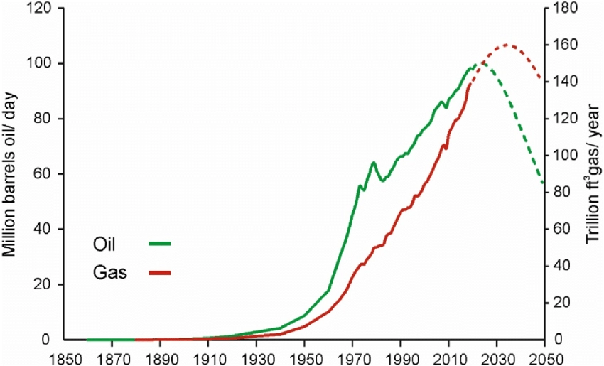

# Egy kis őrület...

| Szerkesztő | Karácson Péter |
|------------|----------------|
| Lektor     | -              |
| Állapot    | v1.0           |

Vannak, akik szerint kolonizálni lehetne más bolygókat, hogy elkerüljük a felelőtlen bolygóhasználat következményeit. 

Nézzük meg csak ezt az egy aprócska bökkenőt: 

Ha egyszer elpazaroljuk minden kőolaj készletünket (mert mondjuk leszünk olyan ügyesek, hogy a klímaváltozások egyre markánsabb 
intő jelei ellenére, nehezített pályán mi valahogy mégis el tudjuk használni), hogyan szerzel szénhidrogéneket egy olyan bolygón, ahol soha nem volt élet?  
# 🤷🏻‍️

Persze mondhatná valaki:
> *Jajj, dehát mindig fedeznek fel újabb lehetőségeket a földön, csak kitoljuk ezt az átmeneti időt, 
> aztán meg majd valami technológia megoldja ezt a problémát…*

Azonban, ha a jelenlegi kőolajfogyasztását befagyasztanánk a világnak mindössze [57 évre elegendő](https://www.worldometers.info/oil/) kőolaja maradna. (2026)  
Továbbá hozzá tenném, hogy amióta felfedeztük ezt az erőforrást, egyre többet fogyasztunk belőle.

Kissé más megközelítés:  
[Eddig kb 1.52 trillió hordót fogyasztottunk](https://www.researchgate.net/figure/Compilation-of-historical-data-on-the-global-consumption-of-oil-and-gas-BP-2020b-Smil_fig4_353523390)

[És 1.72 trillió hordóra becsülik a Föld megmaradt készleteit.](https://en.wikipedia.org/wiki/List_of_countries_by_proven_oil_reserves)

**Félidő van srácok és még csak most kezdtük!**

A következő ábra azt mutatja, hogy amennyi olaj eddig elfogyott, annak kb legalább a 90%-a 1960 és 2020 között, azaz 60 év alatt fogyott el, egyre növekvő léptékben:  

---
# [🔙 Vissza](./health_and_ecology.md)