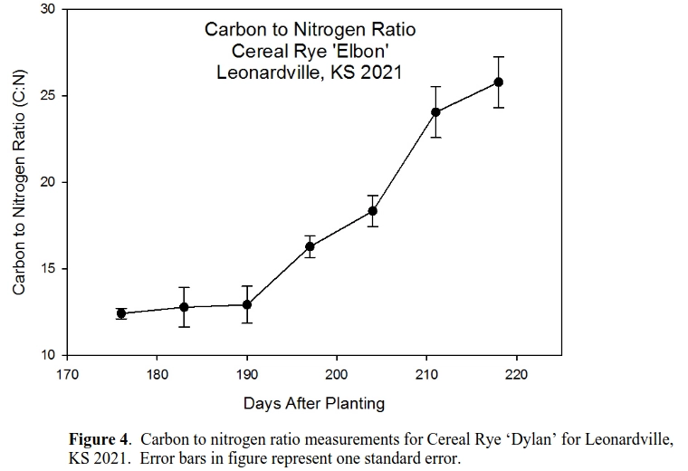
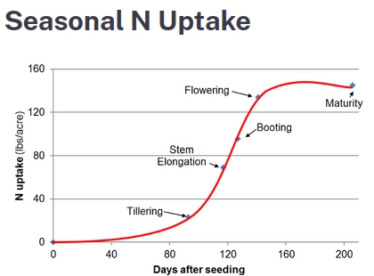

| Szerkesztő | Karácson Péter |
|------------|----------------|
| Lektor     | -              |
| Állapot    | v1.0           |

---
# [🔙 _Vissza_](../dr_gyulai_ivan.md)
---

# Jegyzet Dr. Gyulai Iván előadása alapján: [Gyulai Iván: Mélymulcs – Kertészkedés a természettel (Gyüttment Találkozó 2022)](https://www.youtube.com/watch?v=9pFWzP48HnM&list=PLTWtnJZmrL6yM-z_EBVN37V7rO6CMOT9A&index=6)
(Jegyzet majdnem szó szerint.)

*Hány embert lehetne most ezzel táplálni Magyarországon?*

Ez a technika, amit úgy hívunk, hogy komposzt hagyó mélymulcs, ez kifejezetten kertészkedés. Ugye ez azt jelenti, hogyha már valaki nagyon nagy területen kertészkedik (fél hektár), az már igen komoly feladat. Itt inkább ilyen 500-1000 négyzetméterektől beszélünk. Ugye inkább ennek a korlátozottsága abban áll, hogy ez a vastag takarást össze kell valaonnan szedni. Már látom azt az időt, amikor az emberek verekedni fognak a mulcsnak való biomasszáért. **Jelen pillanatban most én egyébként körülbelül olyan 2ezer alkalmazóról tudok (2022.aug.26.**) **Mindenkinek ez az alapvető problémája, hogy hol szerezzen egy 50-60 centi vastag takarást.** A legtöbben beleszerettek ebbe a lóalmos históriába, mert ugye az én filmjeim azok arról szólnak, hogy 24 órás alommal dolgozom. De az a helyzet, hogy kényszerből már minden mást is kipróbáltam, úgyhogy b**ármiből lehet mélymulcsot készíteni, de van egy kis tudomány.** 

**Nálam, 1 embernek a zöldség gyümölcs ellátásához 500 négyzetméterre van szükség.** Felteszem, mert ugye többször jártam itt ezen a területen, hát ezen a területen ezt nem tudnám elmondani. (Magfalva Cegléd és Pest között), hogy itt elég lenne egy 500 négyzetméter. De nyilván az országnak számos olyan területe van, ahol sokkal kevesebb is elég lenne.

…

Komposztálni tényleg mindenki tud, mert összerakja a szerves anyagot azt valami lesz belőle. Egy komposzt dombnál ez teljesen rendbe van, mert nem számít az idő, viszont a mélymulcsnál nincs rendbe, Azért, mert hogyha nem megfelelő módon állítja valaki össze a takarót, nem megfelelő időben, akkor ez nem fog elkorhadni időre.

…

Ez az 50-60 centi bármilyen hihetetlen másfél-2 centire zsugorodik össze, ha jól csinálom.

Valaki akkor lesz bajban, ha rosszul rakta össze a mulcsot és 30-40 centi marad még neki. Ez akadályozni fogja a termesztésben. A mulcsba vetheti a palántát, de kevés kivételtől eltekintve nem lesz sikere.

**A legtöbb zöldségunk két éves. És ha kivesszük őket, nem fognak magot adni.**

Ha az évelőt lemulcsozom, nézhetek nagyokat, mert nem fog semmi kikelni. Viszont hogyha ősszel **elhullottak a magok takarás előtt** és betakartam. És **május közepére-végére összeesik másfél centire, akkor a mag az pont az ültetési mélységben találja magát**.

Igazából itt tényleg komposztálunk. Hogy ez ebben az időszakban tényleg elkorhadjon, ennek 

**4 feltétele van:**

- 40-60%-os víztartalom (marokpróba) **Ha télen nem volt csapadék akkor szoktuk március elején feltölteni vízzel.** (ha túl sok a csapadék télen, lehetett volna túl nedves is…)
- Részecskeméret: 1-2 mm átmérőjű 10cm-nél hosszabb szálak. Csalán szára optimális. Ami ennél vastagabb, attól nem kell azt várni hogy 6 hónap alatt el fog korhadni.
- 30:1 C:N arány. **Hogyan mérem? Ez azért nehéz mert ugyan azon növénynek és anyagnak más és más a különböző életkorában a C:N aránya. Minden ami zöld, friss, üde, at 1 nitrogén és 12 szén. Ha 30 alatt van a szén, nyers humuszképzőnek nevezzük.
Amikor a búzatő megszakad Péter-Pál környékén, akkor optimális 30:1 C:N arányú.
Amikor learatják, akkor a bálában már 1:60-arányú. Amikor már 30 fölé emelkedett a cén aránya, ezeket úgy hívjuk, hogy rostos humuszképzők. 

Na várjunk… Most akkor el kéne hinnem, hogy a földre fél méter vastagon kihelyezett szalma megtartja a 30:1-es C:N arányt, de a bálában nem?

ÁHHÁÁ
AHÁNYSZOR MEGÁZIK, ANNYISZOR FOG VESZÍTENI A NITROGÉNBŐL
Ezzel az ázással elmehet egészen 1:250-ig is.

”Sívesen küldök önöknek táblázatokat, hogy melyik növényben mekkora C:N arányt mértek, csak el ne higgyék, mert az attól fükk, milyen állapotban van az az anyag.**

Hüger mulcs, (gaja’s garden): Hosszú távú talajjavító stratégia  
  

[Tom Roth, Jason Waite, Early Spring Carbon to Nitrogen Ratios of Cereal Rye Varieties](https://www.nrcs.usda.gov/plantmaterials/kspmcsr13883.pdf)  

[Csak érdekes](https://www.cdfa.ca.gov/is/ffldrs/frep/FertilizationGuidelines/N_Wheat.html)  

  

Ipari közegből nem érdemes szalmát felhasználni a permetszer maradványok és csávázó anyagok nehézfém tartalma miatt.

“Én egyébként 90%-ban szénát használok fel.” 

**A szalma nagyon levegős**, szívószálként is használható. Ezért is szokták azt mondani, hogy a szalma a mulcsnak a tüdeje. **Ez** a levegősség **az oka hogy olyan jól lehet benne gyümölcsöt, tököt, répét egész télen tárolni.**

A széna nem rendelkezik ezzel a jó tulajdonsággal, viszont a széna mulcs anyagként sokkal gazdagabb, mint a szalma. Azért, mert egy tisztességes kaszálóról 30-40 növényfajt letakarítunk. Ennek nagyobb a tápanyagspektruma és más anyagokat is képes a talajból föltárni.

Ezért sokkal jobb egy szénából készült mulcs annak ellenére, hogy a levegő gazdálkodásával sokkal jobban kell törődni.

Ősszel, ha szeretném betakarni a talajt, akkor a talajt muszáj felnedvesíteni. Ha száraz talajt takarnak be, 50-60 centi mulcson egy csepp víz nem fog átmenni. (lehet így működik a nádtető?)

Ez a komposzt hőmérséklet (max 60 fok) nem elég magas hogy a gyömnövény magokat elpusztítsa.

Tehát, **ha szénát használunk, az nem lehet más, mint sarjú. Ez azt jelenti, hogy még nem sarjad, de még nem szökött magszárba.**

**“Mindig szoktam mondani mindenkinek, hogy semmit ne vegyenek!**

Amit nem tudunk megcsinálni magunknak, azt el kell engedni. **Hogyha itt elkezdenek vásárolni, akkor maguk is ezt az ipart fogják éltetni és a boldogságot meg el fogják engedni. Mert mindig azt szoktam mondani, hogy a kert persze teremjen gyümölcsöt is és teremjen zöldséget is, de első sorban boldogságot teremjen. Ha ezt fogják szem előtt tartani, akkor higgyék el, teremni is fog. Nem kell görcsölni.**

Meleg van és aszály van, következés képpen földi bolha van. Most is voltam egy kerben és akkor láttam a sárga lapokat kipakolva. Beleragadva mindenki, aki a sárga lapba beleragad. Hát ilyenkor azért a szívem egy kicsit azért ugye szeretne meghasadni, mert hogy hát most képzeljenek el, hogy jön egy ilyen nagyobb erő és akkor kitesz nekünk ilyen sárga lapot és beleragaszt bennünket és hát amíg ki nem múlunk, addig ott vergődünk. Szóval, hogy itt kéne, hogy legyen egy kis empátiánk.” **A cseresznyelégyre és a nyugati dióburok fúró légy ellen használom én a fa alatt a mulcsot.** Ugye ha kimegyünk az erdőbe és keresünk vad cseresznyefát, akkor nem igazán fogunk benne kukacot találni. Azért, mert az avarban élnek a holyva, a cickány, a futóbogarak és amikor a nyű kihull a termésből, akkor nem sok esélye lesz arra, hogy bebábozzon.

**Kétszer annyi zöld kaszálék kell, mint szalma. Ez már jó mulcsnak.**

## **Nyáron is lehet mélymulcsozni, csak termelni nem fogunk benne.**

### Honnan kerítünk nitrogént ősszel?

- Csalán: Ősszel viszont nincs 1:12-esünk, talán kivéve a **csalán**t. Ha van egy csalánosunk és julius végén, augusztus elején lekaszáljuk, akkor az ki fog újra hajtani és van 1:12-es anyagunk október végén is szalmához. És ez a csalános egézen a komoly fagyokig megvan.
- Vizelet: Egy embernek az éves vizelete 400 négyzetméter kálium, nitrogén és foszfor igényét fedezi. **Ha tartájba tárolom, akkor veszít a nitrogéntartalmából? Ha szalmára vizelek, és azt a szalmát többé nem teszem ki kijuttatás előtt csapadéknak, akkor megőrzi a nitrogént?**

Zab erős gyomelnyomó, de nem értettem, hogy miért. Talán, mert nagyon erős az anaerobikus hatása?

**Bakhátas művelésnek az a legnagyobb hátránya, hogy erodálódik. Ha van kétes eredetű trágyánk, akkor nem erodálódik, nem hagyja a bakhátat kiszáradni és a növények gyökerei onnan fogják venni a tápanyagot.**

Ételmaradékot lehet komposztba tenni, max a patkány vagy a sün elhordja. Ha ők se, akkor a katonalégynek a lárvája fogja elintézni. Kínában ezt iparilag használják. Összes ételmaradékot katonalégy lárvákkal etetik fel aztán csinálnak fehérjedús lisztet takarmányozásra. Úgyhogy mindent be lehet rakni a bakhátak kötepébe. **Tökféléket lehet benne termeszteni, másra nem javaslom.** 

**Széna vagy szalmakrumpli:**

Ez egy Tóth praktika, nagyon régi, hogy szénába és szalmába vetették a burgonyát. Először a burgonyának laza közegre van szüksége. Leget egy korhadék, széna, szalma, porhanyós érett trágya. Minél kötöttebb a talaj, annál nagyobb erő kell hogy a gumó összenyomja és minél jobban összenyomja a talajt, annál jobban anaerobbá válik és leállítja saját maga növekedését. A másik, hogy a burgonyának az optimális talajhőmérséklet az 20 fok. Nem gyökerezik mélyre, 25 centi az optimális gyökérmélysége. 20 fok alatt és 35 fok felett a gyökere elsatnyul és visszafejlődik. Ezért is jó a széna meg a szalma, mert hőszigetel. Ha most valaki ebben a nyári forróságban elvetette és nem a megfelelő mélységbe rakta… ha csak szénaszalmába rakjuk, mindig a nedvesség határára szoktuk rakni. Lerakok 50-60 centi szénást ősszel, megtelik vízzel (amennyire megtelik) elkezdem felülről lebontani, és kb 2/3-ad, 1/3-ad mélységbe rakom a gumót. 1/3 alatta a talajig. A lényeg, hogy ami alatta marad, az nedves. A burgonya 10%-os nedvességkülönbséget tud tolerálni. Ha szárazabb az optimumnál, ilyen kis szatellit burgonyákat kezd el fejleszteni. Amint jön egy kis szárazság, megint ugyan ezt elkezdi. Így őszre 3 féle méretű burgonyánk lesz. Ezen túl van neki kálium igénye meg hasonlók, de ő ezt egy normális közegben megkapja. Az hogy én ráteszem a szénára, nem jelenti azt, hogy ő nem fog begyökerezni a földbe.

A lécből készült **komposzt kerete nagyon jó burgonya termesztésre**. Mondjuk így van 1 köbméteres terünk. Ahogy a léceken vannak a rések, egyik oldalon leteszünk 3 krumplit, teszünk egy réteg komposztot. Átellenes oldalon leteszünk 3 krumplit a réshez, megint egy réteg komposzt képző. Ezt ismételjük amíg ki nem töltjük a köbmétert. A tetejébe mehet koriander és bab. Ezt be kell öntözni és ebbe kell a burgonyát termeszteni. Egy köbméteren egy mázsa megterem. **Babot meg koriandert mindig ültessenek a burgonyához. A bab védi a burgonyabogártól. Mindegy milyen bab.**

**Ha tavaszra nem korhad el a mulcs**, ekkor csinálunk a mulcsban egy árkot. Egészen a talajig ér az alja. Ha már van **televény**, mert idős a mulcs, akkor a tetejére **szórva** is lehet **vetni** a magot. Kisebb magoknál 2-3 centi, nagyobbnál 5 centi **nedves mulcsot visszateszünk**. **Ha nagyon meleg van, addig kell ismételten nedvesíteni, hogy a mag ki ne száradjon.** Nyári melegben 5 nap alatt kiszárad.

A másik, én nem vagyok híve a palántának, ha már palánta akkor csak **földlabdás palánta**. **Édesburgonyát és paprikát** szoktuk palántázni. Ezt a kettőt **Magyarországon muszály palántázni**. Paradicsom: Június közepén eléri a talaj a 25-28°C hőmérsékletet, ami elég a paradicsom csírázásához, így felesleges palántázni.

**Foltos bürök magára vonza a poloskát.** Csak ugye nem szoktuk szeretni mert mérgező. Poloskára még a jércét szokták javasolni, de nekem nincsen problémám, mert tele vagyok ragadozó poloskával. **Engedni kell a természetet. Az a baj, hogy ezt az ember nem hiszi el. De megmondom, én sem hittem el. Sokáig nem hittem el, mindig belenyúltam, mindig megkaptam érte a büntetésemet.**

Volt egy kérdésem korábban, hogy használ e külső forrásból anyagot?

**Használ**

Pl látszik, hogy valahol folyik a víz esőzéskor, akkor a kulcsvonalak mentén meg kéne mulcsozni azzal a kevés anyaggal, ami lejön a földről. (Ezt nem tudom mit jelent, de gondolom azért csinálja, hogy megtartsa a vizet. Szóval lehet pl nagy repedések fölé mulcsolhatnék.)

Legelőn az állat csontra legeli a füvet, nem marad rajta szén, ugyan akkor pisil kakál, rengeteg rajta a nitrogén.

Tehát **a kaszálón hiányzik a nitrogén, a legelőn meg hiányzik a szén.** Ezért kell úgy legeltetni, hogy legalább térdig meghagyom a legelőt.

Van egy kaszálóm. Összehúzom a zöldtömeget 1/10 résznyi sávokra. Ebből keletkezik talaj. ebből a következő évben lesz egy sokkal nagyobb hozam. **A vegetáció kétszer, háromszor nagyobb hozamot fog hozni ezekben a sávokban.** Ha egész területre kivetítem ezt, akkor az egész területnek megnőtt a hozama. **Ha a következő évben odébb lépek és megint megcsinálom az egy tizedét, akkor 10 év alatt végig tudok rajta menni! Ha zöld elég 30 centi magas sorba, különben anaerobbá válik.**

Hagyományosan a paraszt **lékgazdálkodott.** Van egy dzsumbuly, amin van egy “lék” egy kis rés, ahol nincs semmi. Ott van szórt fény, de nem mindig van árnyékolva. És akkor annak a kis léknek kell lenni a kis kertnek. Nőttek a fák, záródtak a lékek, fa elöregedett, kivettük, keletkezett egy új lék. Egy ilyen szép dinamikus rendszer volt. Az a helyzet, hogy **mulcs nélkül meg árnyék nélkül ez nem tud menni.** 

Az a kérdés, hogy mi a célom. **Ha az a célom, hogy jó zöldséges kertem legyen, mindig ugyan oda mulcsolok. Ha az, hogy a teljes területet javítsam, akkor lépkedek a kaszálék sávokkal. Minden kaszálással újabb 30cm vastag takarósávokat készítek.**

Így 4 év kb, hogy a talajélet és annak minősége helyreálljon az ökológiai szabályozással egyetemben. **Az első évben az ember csak a problémákkal fog szembesülni. Ez megint talajfüggő. Ha valaki egy homokon elkezd mulcsolni, már az első évben meg fogja tapasztalni a különbséget. Ha jó a termőföld (van benne humusz), nem lesz olyan látványos. De hiába jó a termőföld, ha bolygatják.**

**Annyi szerves anyag van itt a környezetünkben… addig kéne megragadni, amíg van. Mert ez az év elég világosan megmutatta, hogy azért törékeny. (2022 első nagy aszály, mikor 3 hónapig nem tudodd leesni nyáron a csapadék és a 20-30 éves nyírfák száradtak ki)**

**Náddal nem lehet mulcsolni. Illetve lehet, de majd a következő 10 évben fogok tudni benne valamit csinálni. Ilyen a kukorica és a napraforgó szár is. Lignin tartalom magas? Őket gombák bontják és az egy nagyon lassú folyamat.**

Saját felmerült kérdés: Szudánifű???

A **tarack**ok tarackokkal kapcsolódnak össze, egymás klónjai. Ha azt várom, hogy itt legyen a kertem, de az egész kertem tarackos és letakarom a kertemet papírral (3 hét be, 7 nap ki), semmit nem fogok elérni, azért, mert azok a tarackok, amik kívül vannak a takaráson, azok a tarackon keresztül éltetik a talajban a takargatottat. Ilyenkor körbeárkolhatom a területet addig a mélységig ahol a tartack gyökér lent van.

Egyébként a tarack sem véletlenül van. A lehető legrosszabb talajban telepszik és azt gyógyítani szeretné. Az elporosodott talajt tartja össze. Ha nem lesz ott, elviszi a szél.

Ha tele van porcsinnal a kerted, meg kell enni.

**Kert előkészítés:** Fát felvágjuk a kert kijelölt helyére ősszel. Tavaszra a csersav megöli alatta a vegetációt, nem lesz gyom. Utána teszünk rá komposztot és akkor már csak arról kell gondoskodni, hogy a komposztban lévő gyommagvak ne tudjanak kikelni.

Gyümölcsfák levele könnyen bomlik, a kemény lombú fák levele (platán, gesztenye) nehezen. Diólevél mikor már fekete, lehet vele takarni, csak nem illik, mert a fának a tulajdona.

Permakultúrában használják ezt, hogy letapossák a vegetációt, papírt raknak rá vastagon és utána tesznek rá mondjuk 20 centi földet (én a tulipános tanyától mulcsot is hallottam). Ha mulcsot teszek rá, a papír is elkorhad. Ez olyan szempontból jó lehet, hogy az egy rostos humuszképző (mint búza szár), de figyelni kell a következő rétegzésre: rostos, nyers, rostos humuszképző. Akárhány ilyen réteg lehet, de rostossal kezdek és zárok. **Nem annyira jó ez, mert nagyon lezárja a talajt. Én is használom amúgy szegélyeknek a lezárására. El kell engedni.**

Hogy ne legyen egy területem idézőjelben gyomos, ahhoz az első feltétel a folytonos talajtakarás. Ez lehet mulcs is, de nyilván a **folytonos talajtakarásra a legjobb az élő vegetáció, mikor a növények egymást korlátozzák.**

**Vannak takarónövényes technikák, amiket a no-tillnél is használnak. A fő veteményt (főnövényt) mikor learattam, rögtön felülvetem mindig egyszerre több féle takarónövénnyel. Általában 3 fajta takarónövényt kell kombinálni (hogyha valaki takarónövénnyel mahinál és a talajjavítás a célja):**

1. **Olyan növény, ami nagy zöldtömeget ad, tehát mulcsnak való (Általában szudáni füvek.)** (mustárral az a gond, hogy sárga és vonzza a vizibolhát) **Én az ebszékfüvet szoktam alkalmazni.** 
2. **Nitrogéndús (egy természetes gyepben kb 20-30% körül van a nitrogéngyűjtő növények aránya) Szárazabb területre baltacím. Ha nedves, fehér here, vöröshere. Közepesen nedves állapotnál vegyi here.**
3. **Talaj mechanikai tulajdonságait, szerkezetét javítja. Nálunk erre használják az olajretket. Répa is lehet, lényeg, hogy karógyökér.** 

**Egyszerre kell ezt a három növényt felváltva vetni. Ez nem azt jelenti, hogy három növényből kell ezt összerakni, csak ez a 3 tulajdonság legyen. Lehet az 20 növényből is.**

Az a vita tárgya, hogy glifozáttal terminálják ezeket a növényeket. Azért csinálják ezt, mert egy reteknek kell egalább -10 fok éjszaka, hogy kifaggyon. **Ez a szépséghibája ennek, hogy szerkezetileg kíméli a no-till a talajt, de kémiailag nem.**

**Példa: Őszi főveteményre alávetnek pillangós magkeveréket. Télen a gabona zöldell, a pillangós lappang tavaszig és alászorul a gabonának. A gabonát learatjuk, viszont akkor már ott van. Tehát nincs az a szünet. Itt a probléma azzal van, hogy kiesik két hét (a tarló állapot), amikor nincs ökológiai szolgáltatás. (Amúgy is kevés van egy homogén állománynál.) Ősszel betakarítják a pillangóst takarmánynak, direktvetéssel megy bele a gabona és kezdődik elölről.**

Nálunk ezt az élőmulcsost nem csinálják… inkább a glifozáttal kivégzést végezzük… Ez az élőmulcs a nyugatibb országokra jellemző.

---

Beugrott két dolog:
1. Fater azt mondta a 70es években a virág cukrászdában az üdítőt szalmaszállal kapták. Miért kell nekünk papír “szívószálat” gyárani, hogy lebomoljon, ha a természet ezt ingyen megteszi nekünk?

2. **Ötlet: rácson tartani tyúkokat, amint azok átszarnak és alatta az alacsony nitrogéntartalmú szalmát gazdagítjál?**

---
# [🔙 _Vissza_](../dr_gyulai_ivan.md)
---
